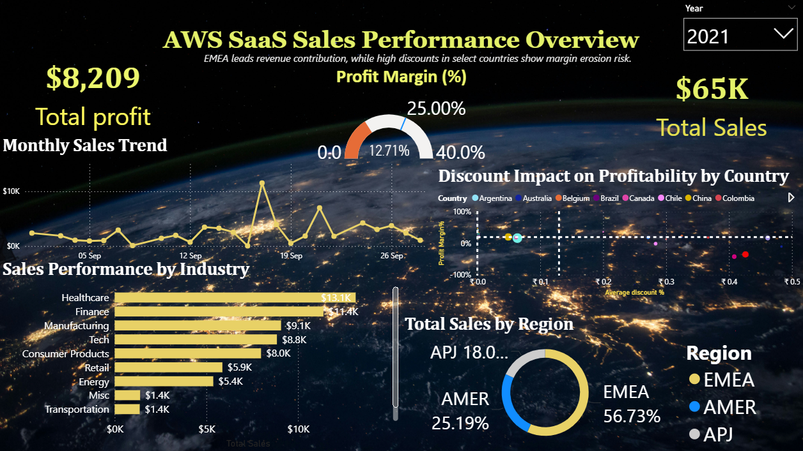

# AWS SaaS Sales Strategic Analytics Hub 📊

This project features a comprehensive Power BI dashboard analyzing global SaaS sales performance, with a specific focus on **discount-driven profit leakage**.

## 🖼️ Dashboard Preview
 

## 🎯 Project Goals
* 📉 **Identify "Profit Leakage":** Pinpointing regions where discounts exceed margin gains.
* 📈 **Trend Analysis:** Tracking monthly sales against industry-specific performance benchmarks.
* 💰 **Executive Summary:** Real-time visibility into Total Profit ($8,209) and Total Sales ($65K).

## 🛠️ Tech Stack
* **Tool:** Power BI Desktop
* **Language:** DAX (Data Analysis Expressions) for complex margin calculations
* **Design:** Advanced Visualization Techniques using custom "AWS Space" themes
